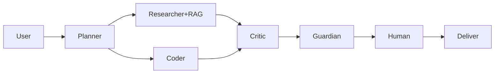

# Architecture
Browser console (index.html) -> optional FastAPI (api/) -> Groq/Gemini.
Modules: agent graph, BM25 RAG, hashed-vector memory, CNN lab, MCP-style tools, evals, SHA-256 audit chain, PWA.

